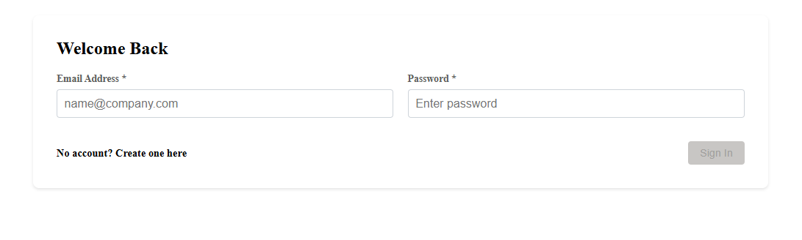
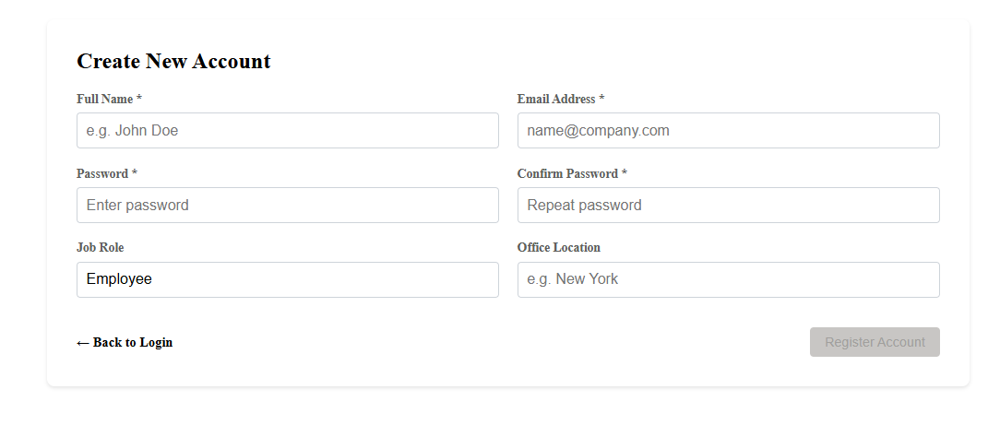
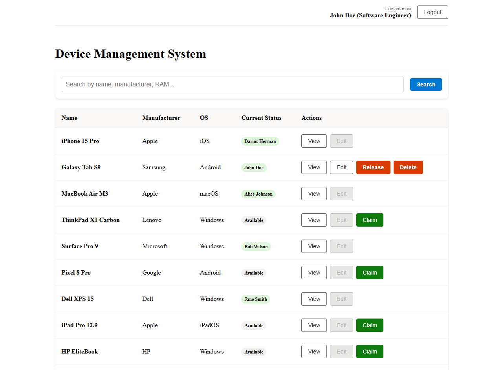
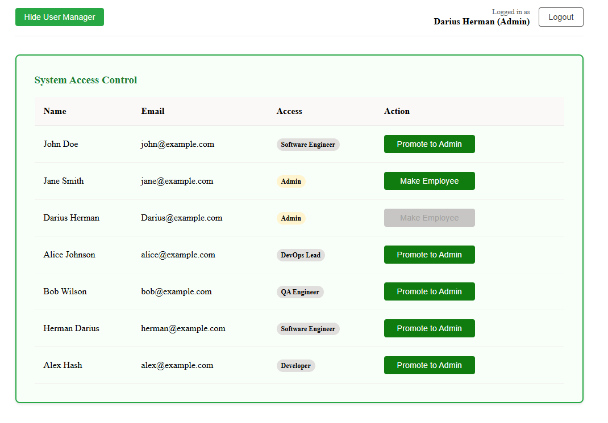
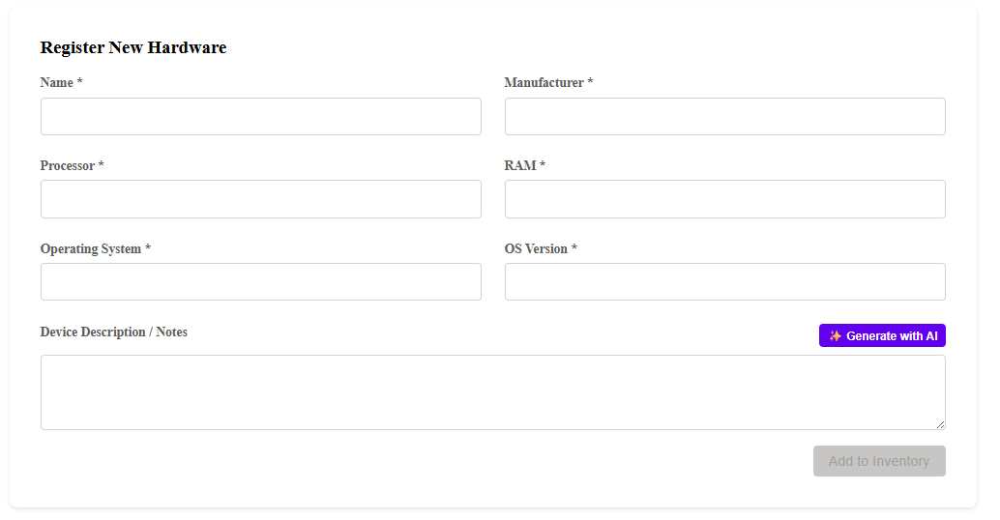
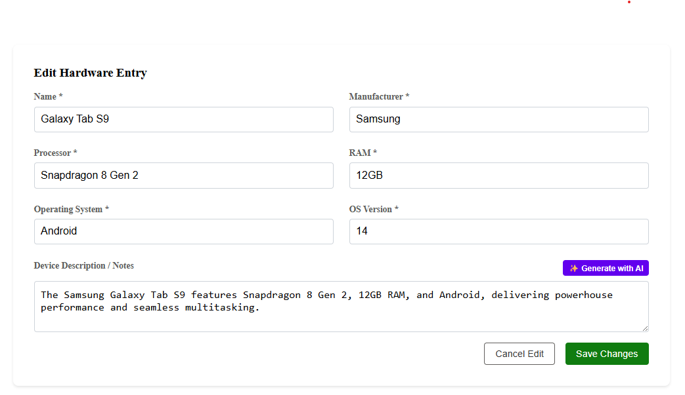
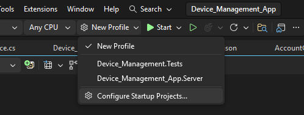
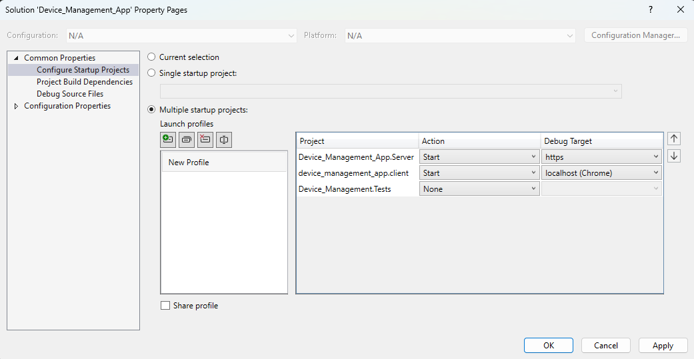
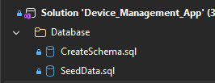

# Device Management System

An enterprise-grade solution for tracking, assigning, and managing corporate hardware assets. This full-stack application is built with a **.NET 10 Web API** backend and an **Angular** frontend, and includes AI-powered technical descriptions along with a custom weighted search engine.

---
## Application Overview

| Login Screen | Registration |
|:---:|:---:|
|  |  |

| Main Dashboard & Search | Admin: User Role Management |
|:---:|:---:|
|  |  |

| Register New Hardware | Edit Hardware Entry |
|:---:|:---:|
|  |  |

---

## 🎥 Video Demo
https://www.youtube.com/watch?v=tZD216nOKu4

---

## Getting Started

### 1. Prerequisites

Make sure you have the following installed:

- **Visual Studio 2022**
- **Node.js**
- **SQL Server**

---

### 2. Installation

```bash
# Clone the repository
git clone https://github.com/Herman-Darius/Device_Management_App

# Navigate to the project directory
cd Device_Management_App
```

---

## Running the Project Locally

### Configure Startup Projects (Visual Studio)

1. Open the solution file `Device_Management_App.sln`.
2. Right-click the **Solution** in the Solution Explorer and select **Configure Startup Projects...**.

   

3. In the Property Pages window, select the **Multiple startup projects** radio button.
4. Set the **Action** for both projects to **Start**.
5. Use the arrow buttons on the right to move `Device_Management_App.Server` to the **top** of the list (ensuring the backend starts before the client).
6. Click **Apply** and then **OK**.

   

---

### Database Setup

This application requires a local SQL Server instance. The scripts are located within the `Database` folder in your solution explorer.



1. Open **SQL Server Management Studio (SSMS)**.
2. Execute **`CreateSchema.sql`**: This creates the database and necessary table structures.
3. Execute **`SeedData.sql`**: This populates the system with initial users and hardware data.

## Authentication

Use the pre-seeded admin account or register a new user:

- **Email:** admin@example.com  
- **Password:** admin  
- **Role:** Admin  

---

## Application Features

### User Features

- **Inventory Dashboard**  
  View a real-time list of all company hardware.

- **Claim / Release Devices**  
  Employees can assign available devices to themselves or release them back to the pool.

- **AI Specification Generation**  
  Generate concise technical descriptions for hardware using **Google Gemini 3 Flash**.

- **Weighted Search Engine**  
  Custom ranking system based on field importance.

---

### Admin Capabilities

- **Global Oversight**  
  Edit or delete any hardware entry.

- **User Management**  
  Promote users to Admin via the **System Access Control** panel.

---

## Tech Stack

- **Backend:** .NET 10 Web API with JWT Authentication  
- **Frontend:** Angular 2.0+
- **Database:** MS Sql 
- **AI Integration:** Google Gemini 3 Flash   
- **Testing:** xUnit  

---

## Search Logic (Bonus Feature)

The search functionality uses a custom **non-AI, token-based ranking algorithm**:

- **Normalization**  
  Converts queries to lowercase and removes punctuation.

- **Tokenization**  
  Splits queries into individual tokens for flexible matching.

- **Weighted Ranking**
  - Name → **10 points**
  - Manufacturer → **5 points**
  - Processor → **3 points**
  - RAM → **1 point**

- **Sorting**  
  Results are sorted by score, with a deterministic tie-breaker using device name.

---

## Notes

- Ensure SQL Server is running before starting the application.
- Backend must start before the frontend for proper API communication.
